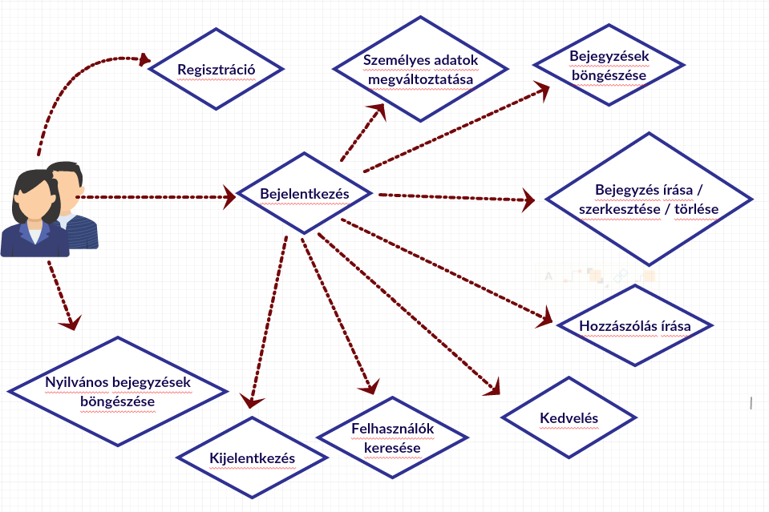
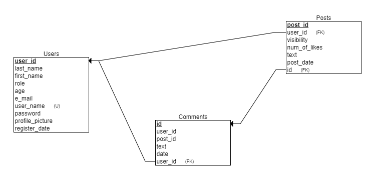

# noSignal

* [Bevezetés](README.md#bevezetés)
* [Elemzés](README.md#elemzés)
  * [Funkciók](README.md#funkciók)
  * [Szerepkörök, jogosultságok](README.md#szerepkörök-jogosultságok)
* [Megoldási terv](README.md#megoldási-terv)
  * [Modell](README.md#modell)
  * [Controller](README.md#controller)
  * [View](README.md#view)
  * [Használt függőségek](README.md#használt-függőségek)
  * [Használt eszközök](README.md#használt-eszközök)
  * [Use-case diagram](README.md#use-case-diagram)
  * [Adatbázisterv](README.md#adatbázisterv)
  * [Végpontok](README.md#végpontok)
* [Fejlesztők](README.md#fejlesztők)

## [Bevezetés](#intro)
A NoSignal egy olyan online felület, ami informatikai témájú bejegyzések, kérdések, hivatkozások és egyéb tartalmak megosztását teszi lehetővé. A regisztrált felhasználók megoszthatják saját gondolataikat, kérdéseiket a nagyközönséggel, hozzászólhatnak más bejegyzésekhez és „kedvelhetik” is azokat.

## [Elemzés](#section)

### [Funkciók](#features)

* Regisztráció: a regisztrációs űrlap kitöltésével lehetséges. Nem regisztrált illetve nem bejelentkezett felhasználó, csak a nyilvános    bejegyzéseket olvashatja, egyéb interakcióra nincs lehetősége. A regisztráció során kötelezően megadandó a felhasználó teljesen neve, e-    mail címe, választott (egyedi) felhasználóneve, jelszava, illetve opcionálisan egy profilkép, ami egy előre megadott listából választható.

* Bejelentkezés: a bejelentkező felületen felhasználónév és jelszó megadásával lehetséges.

* Személyes adatok megváltoztatása: a regisztrált felhasználónak lehetősége van a nevének e-mail címének és jelszavának megváltoztatására.  A felhasználónév nem változtatható. 

* Bejegyzés írása / szerkesztése: minden regisztrált felhasználó megteheti, a főoldalon. A bejegyzés a szövegen kívül tartalmazhat beágyazott YouTube videókat. A bejegyzés írója a későbbiekben szerkesztheti és törölheti is a bejegyzését. Megadható, hogy a bejegyzést csak a regisztrált felhasználók, vagy bárki láthatja –e (nyilvános)

* Bejegyzések böngészése: a főoldalon a regisztrált felhasználók az összes, a nem regisztrált felhasználó csak a nyilvános bejegyzéseket olvashatja. A bejegyzés tetején megjelenik az író felhasználóneve, rákattintva bejön a személyes oldala. A bejegyzések alatt megjelennek a hozzászólások és a kedvelések száma. A hozzászólások mellett olvasható a hozzászólás írójának neve.

* Felhasználó személyes oldala: az adott felhasználó által írt bejegyzések, a láthatóság megegyezik a korábbiakkal. Az oldal tetején a felhasználó neve olvasható, mellette a profilképe, ha van.

* Hozzászólás írása: minden regisztrált felhasználó hozzászólhat bármelyik bejegyzéshez. A bejegyzés alatti felület segítségével. Utólag nem módosítható. 

* Bejegyzés kedvelése: a regisztrált felhasználók „kedvelhetik” egymás bejegyzéseit, a bejegyzésen lévő gomb segítségével. 

* Felhasználó keresése: bejelentkezett felhasználók a főoldal tetején elhelyezkedő keresőmező segítségével a felhasználók neve alapján kereshetnek egymásra. 

* Adminisztrátori funkciók: bejegyzések szerkesztése, törlése, a regisztrált felhasználók adatainak lekérdezése.

### [Szerepkörök, jogosultságok](#roles)

* **Guest**: nem regisztrált felhasználó, csak a nyilvános bejegyzéseket olvashatja el. 

* **User**: regisztrált felhasználó, joga van bejegyzéseket, olvasni, írni, saját bejegyzéseit szerkeszteni, hozzászólásokat írni, bejegyzést kedvelni. 

* **Admin**: teljes hozzáférése van a regisztrált felhasználókhoz, bejegyzéseikhez

## [Megoldási terv](#plan)

A NoSignal létrehozásához Java Spring keretrendszer segítségével REST API-t készítünk. A felhasználók és a bejegyzések adatait adatbázisban tároljuk. A megoldás során az MVC architektúra alapján dolgozunk.

### [Modell](#modell)

A modellünk az adatbázis műveleteket fogja elvégezni, logikailag több részre osztjuk, az entitás osztályok az adatbázisbeli egyedeket írják le, valamint az adatbázis eléréséhez szükséges (DAL) osztályok is idetartoznak.

### [Controller](#controller)

A controller felelős a HTTP kérések kezeléséért, valamint a klienssel való kapcsolat lebonyolításáért. A szerepkörök alapján elvégzi az autentikációt, az egyes műveleteknél szükséges adatellenőrzéseket. Az üzleti logika a Controlleren belül a Service rétegben fog elkülönülni.

### [View](#view)

A megjelenítéshez szükséges elemek. A frontend oldalak megvalósításához TypeScript-et, Angular-t valamint HTML 5 és CSS 3 nyelveket alkalmazunk.

### [Használt függőségek](#dependencies)
* **JPA**: az adatok perzisztálásáért, és az adatok eléréséért felelős keretrendszer.

* **H2**: a felület teszteléséhez használt memóriabeli adatbázis.

* **Lombok**: konstruktorokat, lekérdező és adatmódosító műveleteket generáló keretrendszer.

* **DevTools**: egyéb spring-es fejlesztési eszközök.

### [Használt eszközök](#devTools)
**Build tool**: Appache Maven 3.5.0 (back-end), npm (front-end)  
**Fejlesztői környezet**: IntelliJ IDEA Ultimate 2017.2.5

### [Use-case diagram](#use-case)

### [Adatbázisterv](#database)

### [Végpontok](#végpontok)

* **usr/login**: (User, Admin) POST -> bejelentkezés
* **usr/register**: (GUEST) POST -> regisztráció
* **usr/data**: (User, Admin) POST -> személyes adatok meváltoztatása
* **usr/page?id**: (Admin, User) GET -> felhasználói oldal lekérése
* **posts**: (Guest) GET -> a nyilvános bejegyzések megtekintése, (User, Admin) GET -> az összes bejegyzés megtekintése
* **posts/new**: (User, Admin) POST -> új bejegyzés írrása
* **posts/edit**: (User, Admin) POST -> bejegyzés szerkesztése, törlése
* **posts/comment**: (User, Admin) POST -> hozzászólás írása, módosítása
* **posts/like**: (User, Admin) POST -> bejegyzés kedvelése
* **admin/dashboard**: (Admin) GET -> admin vezérlőpult, adatok lekérése, (Admin) POST -> adatok megváltoztatása

## [Fejlesztők](#fejlesztők)

**[Gecse Viktória](https://github.com/viktoriagecse)**, **[Vadász Péter](https://github.com/pevad95)**, ELTE-IK
